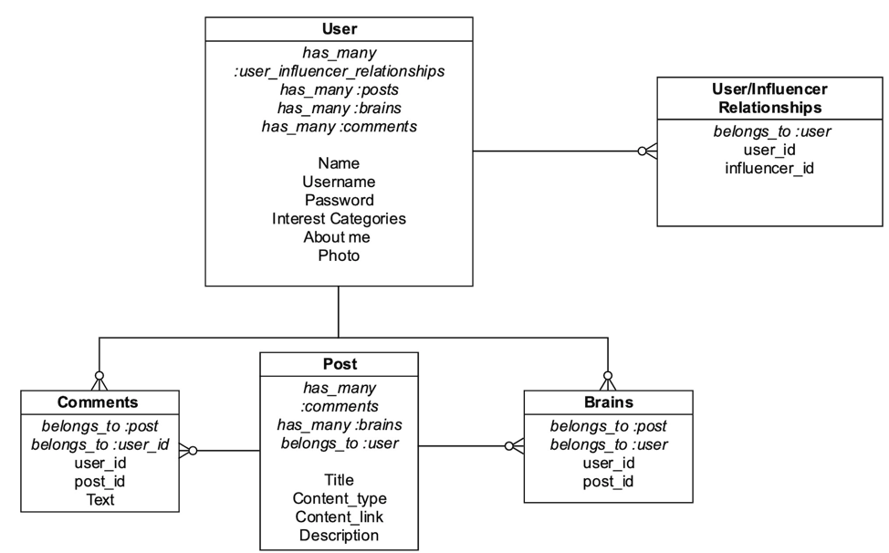

# Brain

#### Molly Nemerever & Njenga Kariuki

###### Project completed as part of [Flatiron School](https://flatironschool.comcampuses/seattle/) curriculum.

## Project FAQ
#### 1. What is Brain?
Brain is a social community dedicated to sharing content that inspires personal and professional growth.

#### 2. How does it work?
After creating an account, users influence others by sharing posts that contain a piece of content — book, podcast, video, or article (from blogs or news sites) — or discover content based on personal and professional areas of interest. Users can follow one another and view a homepage feed of each post from their influencers.

#### 3. What is the customer problem we are solving?
There is a gap between social media platforms and dedicated news and blog sites. Most content consumed on social media platforms does not contribute to personal growth. Even if you are someone who uses Twitter or Facebook for news, you likely find yourself drifting into topic areas you don’t really care about or filtering through ads and poorly curated suggestions. Brain provides a platform for consuming empowering content without the junk, leveraging the power of people who have or seek shared experiences and information.  

## Access Instructions
This project is hosted on Heroku and can be accessed here: https://guarded-coast-75303.herokuapp.com/brain/login
Video demonstration: https://www.youtube.com/watch?v=GKgransM6uk&feature=youtu.be

## Project Requirements
1.	Create a fully functioning website using Rails.
2.	Build user authentication and authorization.
3.	Build a database schema (using Postgres) with a minimum of five models.
4.	Create at least twenty methods across models.
5.	Do not use Javascript (since next learning module is dedicated to Javascript).

#### Time allocated: 4 days

## Database Schema Diagram

